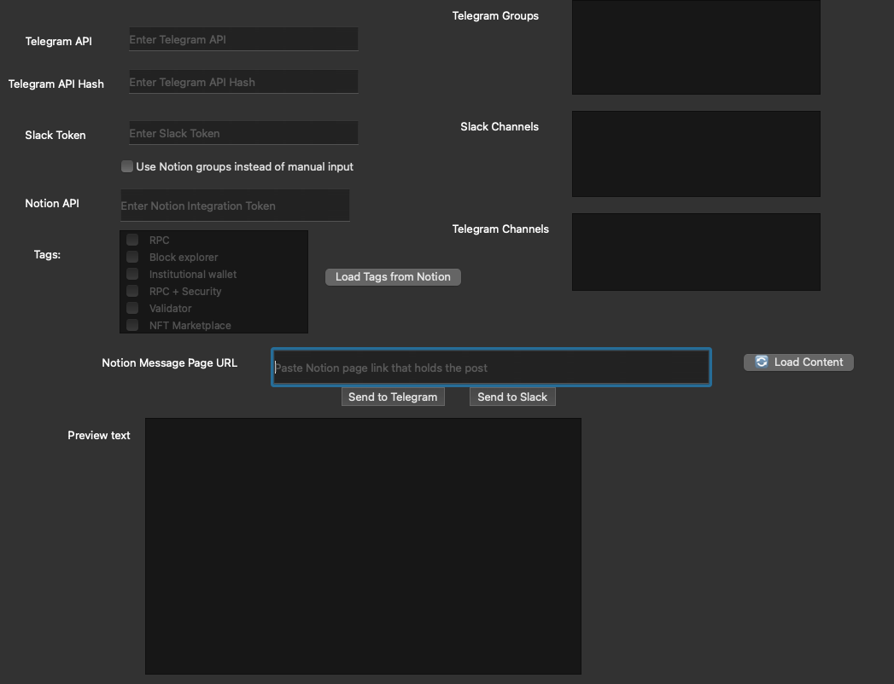

# 🚀 TelegramSlackApp

A cross-platform desktop tool built with **PyQt6** and **asyncio** for broadcasting messages (optionally with images) to **Telegram groups/channels** and **Slack channels** — with optional **Notion integration** for managing groups via tags.

- ✅ Built with PyQt6 for native GUI experience  
- ✅ Sends messages to Telegram & Slack  
- ✅ Supports image attachments  
- ✅ Optional: Pull groups from a Notion database using tags  
- ✅ Easy to install (.pkg for macOS)

---

## 📸 User Interface Overview

Here's what the app looks like on macOS:



### 🧩 Interface Breakdown

| Section | Description |
|--------|-------------|
| **Telegram API / API Hash** | Required to authenticate with Telegram using [my.telegram.org](https://my.telegram.org) |
| **Slack Token** | Your Slack bot token to send messages |
| **Notion API Token** | Required if using tag-based targeting via Notion |
| **Use Notion Groups** | Toggle to enable/disable Notion-based group/channel selection |
| **Tags** | Select tags (fetched from Notion) to target specific channels/groups |
| **Telegram Groups/Channels** | Manually list recipients (1 per line) if not using Notion |
| **Slack Channels** | Same as above, for Slack |
| **Text Field** | The message body |
| **Add Image** | Attach image to be sent with the message |
| **Send Buttons** | Send the message to Telegram and/or Slack |

---

## 🔧 Installation & Usage

### 💻 Option 1: Run from source (Mac/Linux)

```bash
# Clone the repository
git clone https://github.com/yourusername/TelegramSlackApp.git
cd TelegramSlackApp

# Run setup script
bash run_app.sh
```

This script:
- Checks for Python 3 and installs it if missing
- Creates a virtual environment
- Installs required dependencies from `requirements.txt`
- Launches the app

### 🪟 Option 2: Run on Windows

Double-click or run:

```bat
run_app.bat
```

Make sure you have Python 3 and pip installed. The `.bat` script mirrors the bash setup.

### 🍎 Option 3: Install on macOS via .pkg

> Coming soon — generates a `.pkg` using `py2app` and `pkgbuild`.

---

## 📦 Packaging (Advanced)

To package the app as a `.pkg` installer for macOS:

1. Convert the Python script to `.app` using `py2app`:
   ```bash
   python3 setup.py py2app
   ```

2. Run the packaging script (we’ll include this soon) to:
   - Move the app bundle into `pkg-root/Applications`
   - Make it non-relocatable
   - Generate `component.plist`
   - Create final `.pkg` file using `pkgbuild`

---

## 🧠 Project Structure

```
TelegramSlackApp/
│
├── app.py                    # Main application logic
├── ui_mainwindow.py         # PyQt6-generated GUI file
├── ui_mainwindow.ui         # Original Qt Designer file
├── setup.py                 # py2app build script
├── requirements.txt         # Python dependencies
├── run_app.sh               # Shell script for Linux/macOS
├── run_app.bat              # Windows runner
├── README.md                # This file
└── (pkg-root/, dist/, build/) # Generated during build
```

---

## 🧠 Features

- 📤 Send messages to multiple Telegram groups/channels and Slack channels simultaneously
- 🖼️ Optionally attach an image
- 🧠 Intelligent channel selection via **Notion tags**
- 🔒 OAuth-free authentication using Telegram’s API ID + API Hash
- 🔁 Retry-safe Telegram client with session caching

---

## 💡 Notion Integration (Optional)

To use Notion-based message routing:

1. Create a Notion integration: [https://www.notion.so/my-integrations](https://www.notion.so/my-integrations)
2. Share your target database with the integration
3. Use this schema in your DB:

| Property         | Type          |
|------------------|---------------|
| Platform         | Select (`Telegram` / `Slack`) |
| Category         | Multi-select (tags like "Exchanges", "Validators") |
| Contact Name / Channel ID | Text (e.g., Telegram channel username or Slack channel ID) |

---

## 🛠️ Development

Make sure to activate your virtual environment:

```bash
source venv/bin/activate  # or use your IDE’s interpreter
```

Then run:

```bash
python app.py
```

